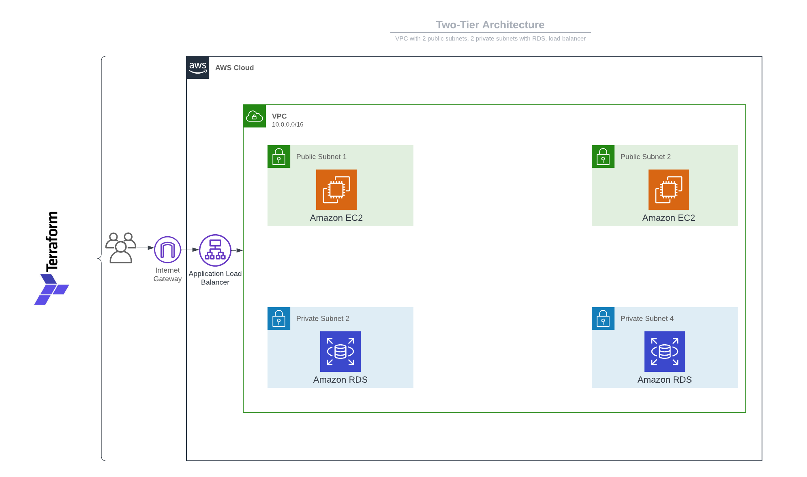
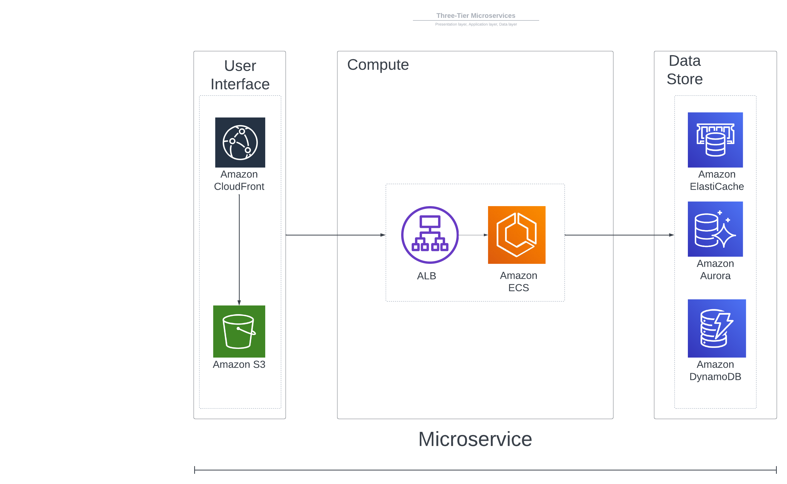

# cloudcamp.github.io
Cloud camp projects and documentation blog

# Part 1: Bash
1. What is Bash/Terminal: A terminal is where Bash commands are executed. Bash is a very powerful tool that increases efficiency.

2. Help within Bash: The help and man (manual) commands are useful to understand what each command does (e.g., man cd, cd help, cd --help). Use these commands when needed instead of Googling. Several options are allowed for commands, and these are supported by many Command Line Interfaces (CLIs). The /EXAMPLES section within the manual is also helpful. Use what is useful. To exit, simply type q.

3. Navigating the terminal: Use commands such as PWD (print working directory) to show the directory you are in. CD allows you to change the directory, and whoami tells you which user is logged in. You can also use the CD command with the file path to get to a certain directory. Push adds a directory to a stack, pop will take them off just like this using the pop and push command. cd ../../.. brings you back to different levels.

4. List with ls: ls will list the content of the directory. -a will show hidden and non-hidden files; green files are directories. S* will show any files with capital S, *[]* also allow for multiple characters. *.?? looks for single characters (i.e., MD). [[upper]] looks for uppercase characters. You can do this with lowercase as well.

5. Where am I?: Whereis helps you locate certain files. The which command will only show executable files. Find does not have any constraints.

6. Making/removing files and directories: mkdir creates a directory. -p allows you to make subdirectories under the parent directory. The touch command allows you to create files. The mv command allows you to move files from source to destination. You can use wildcards to move multiple files at once. cp allows you to copy files and directories. rm allows you to remove files, and rmdir allows you to delete directories. Wildcards can also be used with these commands.

7. Reading files: Bash allows you to read files using the cat command. The head command allows you to return the first 10 lines. Tail will give you the last 10. Use -n(x) with tail or head to get the first n amount. More and less give the whole file as if you were using a text editor. Less allows you to navigate the file using /. H will give you the commands. Grep allows you to pull out specific information (e.g., grep "DELETE").

8. Environment variables: Environment variables allow you to change the variables within the terminal. Use env to see them. Export allows you to create variables. These newly created variables are only in the current session, not in new ones. For them to remain, these files need to be in the startup files /etc/profile and the home directory .profile and .bashrc.

9. Redirection and Pipelines: The ls -l command can be redirected using the greater-than sign (>) followed by a file name. You can also append output to an existing file using >>, which will add new content to a file without overwriting it. To redirect standard errors, you can use 2> followed by a file descriptor to indicate error redirection to a different location. To combine standard output and standard error and redirect them to the same file, you can use 2>&1. Alternatively, you can achieve the same result with &>. You can redirect the output of multiple commands to a file, for example: cat 1.txt 2.txt > 3.txt
This command will combine the contents of 1.txt and 2.txt and save the result in 3.txt. You can also pipe the output of one command into another using pipelines (|). For instance, using | less can help you navigate through large files more easily. You can narrow down your search by combining the grep command with pipelines, like | grep echo. Additionally, you can sort the output of a command using | sort. To extract specific lines from a file, you can use head and tail. head -n 1 will give you the first line of a file, making it easier to locate specific information. Conversely, tail will display the last lines of a file. These redirection and pipeline techniques are essential for efficiently managing and processing data in the command line environment.

10. How to View Permissions and Modify Them: The ls -l command will display various information about files and directories. It indicates file types with a 'd' for directories (highlighted in green) and '-' for regular files. Following this, you'll find the user permissions, group permissions, and other permissions (if you are not part of the group). The owner's name is listed to the right. The owner has full control over the file. To change the ownership of a file or directory, you can use the chown command. For example, sudo chown root newFile.txt would change the owner to the root user (sudo privileges are needed). To modify the group ownership, you can use sudo chown : followed by the group name, but this changes the group, not the user. Alternatively, you can use the chgrp command followed by the group name and the file/directory name to change the group ownership. To modify permissions, you should use the chmod command. For instance, chmod +x grants execute permissions to a file. You can also use the octal format to assign values for read (r), write (w), and execute (x) permissions of a file. Understanding and managing permissions is crucial for effective file and directory management in a Unix-like operating system.
Example:
  owner      group     others
  r  w  x    r  w  x   r  w  x
 (4)(2)(1)  (4)(2)(1)  (4)(2)(1)

11. A Bash script is a text file containing a sequence of commands designed to be executed within a Bash shell environment. These scripts are a powerful tool for automating tasks, performing system administration tasks, or simply organizing and executing sets of commands efficiently. Key Elements and Best Practices: Shebang Line: Every Bash script should begin with a shebang line, which specifies the interpreter that should execute the script. In the case of Bash scripts, the shebang line looks like this: #!/bin/bash. This line tells the system to use the Bash shell to interpret the script's commands. Execution Permission: Before you can run a Bash script, you must grant it execution permission. You can use the chmod command to do this. For instance, to give the script full execution permissions for the owner and the owner's group, while restricting others, you can use:chmod 700 Name-Of-File. Alternatively, you can use chmod +x Name-Of-File for a simpler way to grant execution permission. Moving to a Directory in $PATH: To make your Bash scripts easily accessible from any location in the terminal, it is recommended to move them to a directory that is included in the system's $PATH environment variable. Common choices include /usr/local/bin or ~/bin (for user-specific scripts). Here's an example of moving a script to /usr/local/bin: sudo mv Name-Of-File /usr/local/bin/. After moving the script, you can run it from any directory without specifying its full path.

12. Variables: Variables are used to store data within a bash script. This lets you reuse code. Constants do not change where as variables change. Read-only assigns a constant. Bash variables can be called using the '$' sign (hello_world='Hello, world!'echo $hello_world). Readonly varibles remain the same; these will not change. Constants will not change.

13. Conditional statements: success or failure of a command will trigger an action.
EXAMPLE:
-#!/bin/bash
#Prompt the user to enter the first number
echo "Enter the first number:"
read num1
#Prompt the user to enter the second number
echo "Enter the second number:"
read num2
#Calculate the sum
sum=$((num1 + num2))
#Display the result
echo "The sum of $num1 and $num2 is $sum"-
- This script showcases basic user input, variable assignment, arithmetic operations, and output in Bash.

14. Case statements: Allows an action based on the value of a variable or of an expression. 
    EXAMPLE: #!/bin/bash

- A script that will ask for a number and print out a message depending on the value. 

-read -p "Enter a number: " n
case $n in
    ???) 
        echo "One";;
    2) 
        echo "Two";;
    aa) 
        echo "Three";;
    *.txt) 
        echo "Four";;
    *) 
        echo "Other";;
esac-

This Bash script prompts the user to input a value, stores it in the variable n, and then uses a "case" statement to check the value of n. Depending on what n contains, it prints out different messages. If n is "???" it prints "One," if it's "2" it prints "Two," if it's "aa" it prints "Three," if it ends with ".txt" (e.g., "myfile.txt") it prints "Four," and for any other input, it prints "Other." This script demonstrates how to make decisions and take different actions based on the value of a variable using the "case" statement in Bash.

15. Functions in Bash: A fucntion is code which can be referenced by its name and is used to break code into mini, reuseable scripts. 
-#!/bin/bash

check_even () {
    local mod=2
    echo "The value of mod is $mod"
    if [ $(("$1" % $mod)) -eq 0 ]
    then 
       echo "The number $1 is even!";
    else 
       echo "The number $1 is odd!"
    fi
}

number=2344

check_even $number
echo $mod-

This Bash function named check_even is designed to determine whether a given number is even or odd. It takes one argument, 1, which represents the number to be checked. Inside the function, it calculates the remainder when the input number is divided by 2 and checks if this remainder is equal to 0. If the remainder is 0, it prints "The number is even," otherwise, it prints "The number is odd." However, there is an issue with trying to print the value of the mod variable outside the function, which will result in an error since mod is defined as a local variable within the function and cannot be accessed outside of it.

16. Loops in Bash: Loops are programming constructs that allow you to repeatedly execute a set of commands or statements as long as a specified condition is met or for a defined number of iterations (i.e. WHILE loop, UNTL loop, FOR loop). 

WHILE LOOP:
-counter=1
while [[ "$counter" -le 10 ]]; do
    echo "The counter is at: $counter"
    counter=$((counter + 1))
done
echo "The count has finished."-
- This script sets a variable called "counter" to 1. It then enters a loop that continues as long as "counter" is less than or equal to 10. Inside the loop, it prints the current value of "counter," increments it by 1, and repeats this process until "counter" reaches 11. After the loop finishes, it prints "The count has finished," indicating that the counting process is complete.

UNTIL LOOP: 
-counter=1
until [[ "$counter" -gt 10 ]]; do
    echo "The counter is at: $counter"
    counter=$((counter + 1))
done
echo "The count has finished."-
- In this script, a variable named "counter" is initially set to 1. It enters a loop that continues until "counter" is greater than 10. Inside the loop, it displays the current value of "counter," increases it by 1, and repeats this process until "counter" becomes greater than 10. After the loop concludes, it prints "The count has finished," signifying the end of the counting process.

FOR LOOP, Traditional:
-services=("loadbalancer" "virtualmachine" "storage")

for i in "${services[@]}"
do
   echo $i
done-
- This Bash script defines an array called "services" containing three values: "loadbalancer," "virtualmachine," and "storage." It then uses a "for" loop to iterate through each element in the "services" array. During each iteration, it prints the current element (service) to the console. As a result, it displays each of the three services on separate lines in the terminal.

FOR LOOP: 
-#!/bin/bash

#A script to display a series of numbers using a for loop.

for (( i=0; i<5; i=i+1 )); do
    echo "The counter is at: $i"
done-
- This Bash script uses a "for" loop to display a series of numbers. It starts with a variable "i" set to 0 and continues the loop as long as "i" is less than 5. During each iteration, it prints the value of "i" along with the message "The counter is at," incrementing "i" by 1 with each pass. As a result, it displays the numbers 0 through 4, indicating the count from 0 to 4 in the terminal.

LOOP AND BREAK: 
-while true; do
  read -p "Enter a number between 1 and 25: " n
  if [[ $n -ge 1 && $n -le 25 ]]; then
    echo "You entered $n"
  else 
    echo "You didn't enter a number in range, goodbye."
    break
  fi
done

echo "Break happened"-
- This Bash script creates an interactive loop that continuously prompts the user to enter a number between 1 and 25. It uses the "read" command to get the input and checks if the entered number falls within the specified range (between 1 and 25). If the number is within the range, it displays the entered number. If not, it informs the user that they didn't enter a number within the range, says goodbye, and exits the loop using "break." Finally, it prints "Break happened" to indicate that the loop was terminated.

17. Writing a Bash Script: Here's a simple Bash script to create an AWS resource group using the AWS Command Line Interface (CLI). Before running this script, make sure you have the AWS CLI installed and configured with the necessary access credentials.

-#!/bin/bash

#Set your AWS region and resource group name
AWS_REGION="us-east-1"  # Replace with your desired AWS region
RESOURCE_GROUP_NAME="MyResourceGroup"  # Replace with your desired resource group name

#Create the resource group
aws resourcegroupstaggingapi create-resource-group \
  --region "$AWS_REGION" \
  --resource-group-name "$RESOURCE_GROUP_NAME"

#Check if the resource group creation was successful
if [ $? -eq 0 ]; then
  echo "Resource group '$RESOURCE_GROUP_NAME' created successfully in region '$AWS_REGION'."
else
  echo "Failed to create the resource group."
fi-
- This script sets the AWS region and the desired resource group name, and then it uses the AWS CLI to create the resource group. It checks the exit status of the AWS CLI command to determine if the creation was successful and provides appropriate feedback.

# Part 2: Networking
1. OSI (Open Systems Interconnection Reference) model is an overall guide for data flow, consisting of 7 layers:

Physical
Data Link
Network
Transport
Session
Presentation
Application
(A helpful mnemonic for remembering these layers is: "All People Seem To Need Data Processing".)

The Physical layer comprises cables and wires. The Data Link layer references MAC addresses and the switching and bridging layer. The Network layer, or routing layer, refers to the Internet Protocol. Fragmentation occurs when data size is larger than the supported size and needs to be split into smaller pieces to be sent through the network (in multiples of 8). It takes many packets to put together a webpage; it is split into smaller pieces and sent across the network using the TCP and UDP protocols.

Layers 5, 6, and 7 deal with how applications handle communication. Many applications handle their own communication processes. All of this happens at Layer 5. Layer 6 deals with character encoding and application encryption. Many applications work at both Layer 6 and Layer 7. Layer 7 is the application layer that the user interacts with.

| 7. Application: What the user sees |

| 6. Presentation: Application encryption (SSL/TLS) |

| 5. Session: Control protocols, tunneling protocols |

| 4. Transport: TCP segment, UDP datagram |

| 3. Network: IP Address, Router, Packet |

| 2. Data Link: Frame, MAC Address, Extended Unique Identifier (EUI-48, EUI-64), Switch |

| 1. Physical: Cables, fiber, signal |

2. All about IP:

IP Addresses: IP addresses are numerical labels assigned to each device connected to a computer network that uses the Internet Protocol for communication. They serve two primary functions: identifying the host or network interface and providing the location of the host in the network. Networks operate by the client (Ethernet header) sending information called the payload to the server (Ethernet Trailer). The Ethernet payload typically contains the Internet Protocol (IP) with an IP payload and IP header. Within the IP payload, there can be TCP data and a TCP header. The TCP payload can be separated out into HTTP data.

TCP and UDP: These protocols are transported within the IP packet and are a common way to move data. TCP and UDP operate at OSI layer 4. They offer features that IP does not provide, such as the ability to use many different apps at once, made possible by multiplexing. TCP is connection-oriented (verifiable, reordering messages/re-transmissions, flow control), whereas UDP is connectionless (no formal process, no receipts, no flow control). UDP is suitable for real-time communication and is used by connectionless protocols such as DHCP (Dynamic Host Configuration Protocol) and TFTP (Trivial File Transfer Protocol). Connection-oriented protocols requiring a "return receipt" include HTTPS (Hypertext Transfer Protocol Secure) and SSH (Secure Shell).

Port Numbers: Ports indicate which applications are sending data. They can be encrypted or unencrypted and are typically represented as: -Server IP, protocol, server application port number -Client IP address, protocol, client port number. Port numbers are usually permanent and non-ephemeral (Ports 0 - 1023, e.g., 80 for HTTP, 443 for HTTPS), but they can vary. When communicating with a server, a device will use ports 1024-65535, assigned in real-time by the client. These are temporary ports (ephemeral) determined by the operating system. TCP and UDP can use ports 0 - 65,535. Most servers use non-ephemeral ports, but not always. Port numbers are only for communication, not security. Well-known services use specific port numbers. TCP and UDP have different port numbers (e.g., TCP port 80 and UDP port 80).

3. Routing and Switching:

Routers and Switches: Routers route traffic between IP subnets and are OSI layer 3 devices, whereas switches operate at layer 2. Routers are not primarily designed for security, but some functions such as Access Control Lists (allowing or denying traffic based on source IP, destination IP, port numbers, and rules) do exist. Switches bridge traffic in hardware, using an application-specific integrated circuit. They forward traffic based on MAC addresses/data link addresses. Switches often have many ports for high-bandwidth traffic. Security is commonly handled using Network Access Control, which requires authentication (username and password).

4. MAC Address:

Media Access Control (MAC) Address: The MAC address is a 12-character string that identifies a device to connect to Wi-Fi, Ethernet, or Bluetooth. The first 6 characters represent the block ID unique to the manufacturer, differentiating devices on the same network. DHCP uses the unique MAC address to assign local IPs. MAC addresses only need to be unique on the local area network. Devices on the same network must have unique MAC addresses; otherwise, frames might be shared across devices. MAC addresses should be changed if this situation arises.

5. DNS (Domain Name System):

The Domain Name System (DNS) translates human-readable domain names into IP addresses. These names are organized in a hierarchical structure and are distributed via databases across numerous DNS servers, including 13 root clusters, top-level domains (TLDs), and country codes. DNS can be either internal, managed and configured by local teams within an organization, or external, managed by third-party providers without internal device information.There are two types of DNS queries: recursive and iterative. Recursive queries involve a DNS server performing the lookup and reporting back, utilizing caching to enhance speed. Iterative queries are manually executed, and the DNS cache is specific to the user. The authority of the DNS server influences the type of information a user receives. Authoritative information comes directly from the DNS, whereas non-authoritative information may be cached data and does not contain zone source files. All DNS responses have a Time to Live (TTL), specifying how long a cache is valid. Lookups can be performed in two ways: forward lookups (providing the DNS server with a Fully Qualified Domain Name) or reverse lookups (providing the DNS server with an IP address). DNS plays a crucial role in translating user-friendly domain names into the numerical IP addresses necessary for internet communication.

6. VPNs

Using a Virtual Private Network (VPN) encrypts data as it travels through a public network. In this process, a concentrator encrypts the data, sends it out, and then decrypts it at the destination. There are various solutions available, which can be hardware-based or software-based.
On the client side, encryption and decryption of data occur. Individual users can opt for SSL VPN (Secure Sockets Layer, on port 443/tcp). SSL VPNs don’t require specific VPN clients, utilize authentication, and can operate within an operating system or a web browser. Additionally, HTML5 supports the Web Cryptography API, creating a VPN tunnel without the need for a dedicated VPN application. In VPN setups, there are different configurations: 
Full Tunnels: Encrypt all data entering and leaving the user’s device. Users can't bypass the VPN to send information directly.
Split Tunnels: Allow more flexibility, permitting tunneled and non-tunneled traffic.
Site-to-Site VPNs: Encrypt data between concentrators or firewalls. These connections are generally always on. Site-to-site VPNs often use the Layer 2 Tunneling Protocol, which connects over Layer 3 as if they were directly connected at Layer 2. These VPNs generally use IPSec (Internet Protocol Security) for authentication and encryption. IPSec has two major protocols:
Authentication Header (AH): Provides data integrity by hashing the packet (using SHA-2) and utilizing a shared key.
Encapsulation Security Payload (ESP): Allows encryption across the IPSec tunnel, adding extra headers and trailers. AH and ESP are commonly combined for both integrity and authentication.
Data can be sent via IPSec using two modes:
Transport Mode: Puts the IP header upfront, followed by the IPSec headers, encrypted data, and then the IPSec trailers.
Tunnel Mode: Encrypts both the IP header and the data and sends it to the concentrator.
In summary, VPNs, through various configurations and protocols like SSL, IPSec, AH, and ESP, provide secure and encrypted communication channels over public networks.

7. TLS and SSL
   
SSL (Secure Sockets Layer) is a technology that secures the connection between a user's web browser and the website they are visiting. It encrypts the data transmitted between the user and the website, making it difficult for unauthorized parties to intercept or tamper with the information. TLS (Transport Layer Security) is an updated and more secure version of SSL. It also encrypts data transmitted over a network, ensuring privacy and data integrity. TLS is the modern and widely used protocol for securing connections on the internet. TLS is often used interchangeably with SSL, though it represents the more recent and improved versions of the encryption technology.

